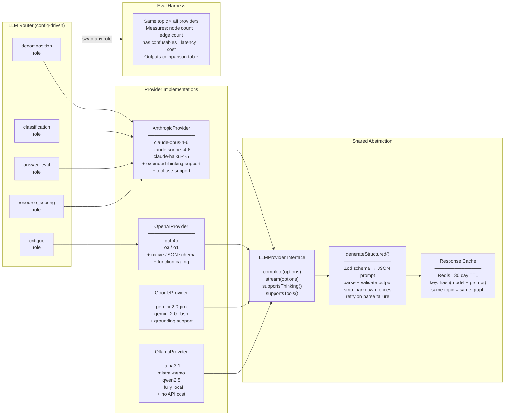
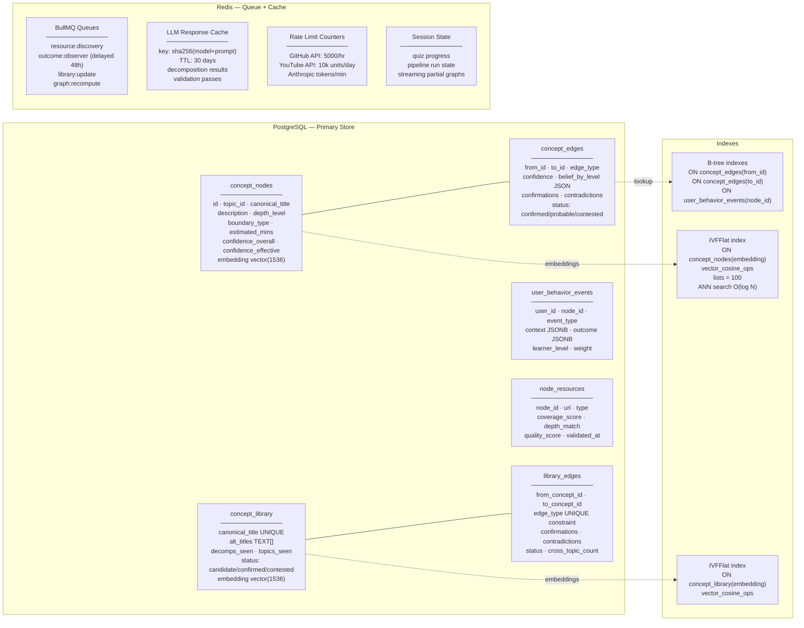
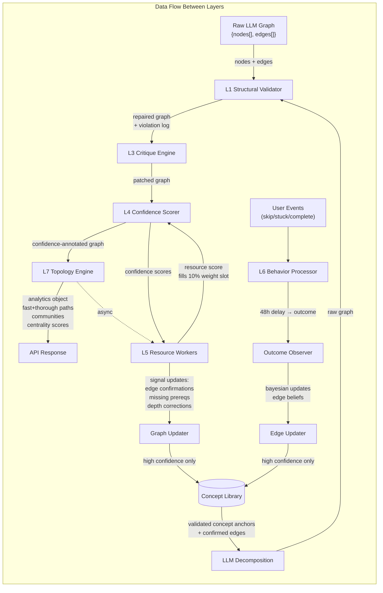

# Topic Decomposition Engine — Architecture

---

## 1. System Overview

```mermaid
flowchart TD
    USER([User Input\nTopic + Context]) --> INTENT

    subgraph SYNC["⚡ Synchronous Pipeline  (target: < 15s)"]
        direction TB

        INTENT["Intent Parser\n─────────────\nLLM: Haiku\nExtracts: level, goal, gap"]

        INTENT --> LIBSEARCH

        subgraph MEM["Layer 2 — Semantic Memory"]
            LIBSEARCH["Vector Search\n─────────────\nEmbed topic → cosine similarity\nRetrieve validated concept anchors"]
            LIBSEARCH --> LIBRES[(Concept Library\npgvector)]
            LIBRES --> LIBSEARCH
        end

        LIBSEARCH --> DECOMP

        subgraph DECOMP_BLOCK["LLM Decomposition  (grounded)"]
            DECOMP["Prerequisite Inference\n─────────────\nLLM: Opus + Extended Thinking\nOutputs: nodes + edges (raw graph)"]
            DECOMP --> BOUND["Boundary Detection\n─────────────\nLLM: Sonnet\nClassifies: core / optional_depth / out_of_scope"]
        end

        BOUND --> SV

        subgraph L1["Layer 1 — Structural Validation"]
            SV["Cycle Detector\nDFS  O(V+E)"]
            SV --> OR["Orphan Detector\nBFS  O(V+E)"]
            OR --> DI["Depth Inversion Check\nLinear scan  O(E)"]
            DI --> TR["Transitive Reduction\nPath existence  O(V·E)"]
            TR --> GV["Granularity Check\nHeuristic rules"]
            GV --> REPAIR{"Auto-repair\npossible?"}
            REPAIR -- Yes --> REPAIRED["Apply repair\nremove edge / merge node\nadjust depth / adjust time"]
            REPAIR -- No --> LLMFIX["LLM Targeted Fix\n1 call per violation"]
            REPAIRED --> VALIDATED["✓ Structurally Valid Graph"]
            LLMFIX --> VALIDATED
        end

        VALIDATED --> CRIT

        subgraph L3["Layer 3 — Critique-Refine  (max 2 rounds)"]
            CRIT["Critic\n─────────────\nLLM: configurable\nRubric: granularity, completeness,\nprereq accuracy, boundary, teachability"]
            CRIT --> VERDICT{"verdict?"}
            VERDICT -- needs_revision --> PATCH["Patcher\n─────────────\nLLM: Sonnet\nSurgical per-issue calls\nsplit / add / remove / reclassify"]
            PATCH --> CRIT
            VERDICT -- good --> REFINED["✓ Pedagogically Sound Graph"]
        end

        REFINED --> CONF

        subgraph L4["Layer 4 — Confidence Scoring"]
            CONF["Multi-Run Verifier\n─────────────\n1 full run + 2 cheap verify passes\nSemantic match via embeddings"]
            CONF --> LIBEV["Library Evidence Score\nSigmoid on confirmation count"]
            LIBEV --> CRPEN["Critique Penalty\nWeighted by severity"]
            CRPEN --> PROP["Confidence Propagation\nTopological traversal  O(V+E)\nweak prereq → reduces downstream"]
        end

        PROP --> TOPO

        subgraph L7["Layer 7 — Topology Engine  (pure algorithms, no LLM)"]
            TOPO["Betweenness Centrality\nBrandes  O(V·E)"]
            TOPO --> PATHS["Shortest Path\nDijkstra  O((V+E) log V)\nfast track vs thorough track"]
            PATHS --> COMM["Community Detection\nLouvain  O(E log V)\nauto chapter grouping"]
            COMM --> REACH["Reachability Analysis\nBFS per node  O(V·(V+E))"]
            REACH --> ANAL["Graph Analytics Object\ncentrality · paths · chapters\nunlock counts · critical path"]
        end
    end

    ANAL --> OUTPUT

    subgraph OUTPUT["Output  (returned to user)"]
        direction LR
        G1["Concept Graph\n+ confidence annotations"]
        G2["Fast Track\nhard prereqs only"]
        G3["Thorough Track\nfull prerequisite path"]
        G4["Chapters\ncommunity-grouped"]
        G5["Next Node\ngap analysis recommendation"]
    end

    ANAL -. async enrichment .-> ASYNC

    subgraph ASYNC["⏳ Asynchronous Pipeline  (BullMQ workers)"]
        direction TB

        subgraph L5["Layer 5 — Resource Signals"]
            RQ["Resource Queue\n1 job per node"]
            RQ --> FETCH["Content Extractor\nHTML / YouTube / GitHub / arXiv"]
            FETCH --> RSCORE["Resource Analyzer\n─────────────\nLLM: Haiku\nCoverage · depth match\nassumed prereqs · adjacent concepts"]
            RSCORE --> AGG["Signal Aggregator\ncount votes across resources"]
            AGG --> RUPDATE["Graph Updater\n─────────────\nConfirm edges · surface missing prereqs\nCorrect depth · adjust boundary\nThreshold-gated application"]
        end

        subgraph L6["Layer 6 — User Behavior"]
            EV["Event Collector\nskip · stuck · complete\nfast · slow · revisit"]
            EV --> OBS["Outcome Observer\n─────────────\n48h delay job\nObserves dependent node success/failure"]
            OBS --> BAY["Bayesian Edge Updater\nbelief += α · (signal - belief)\nper learner level"]
            BAY --> DEBT["Learning Debt Analyzer\nreachability diff · urgency scoring"]
        end

        RUPDATE --> LIBWRITE
        BAY --> LIBWRITE

        LIBWRITE["Library Write-back\n─────────────\nHigh confidence only (≥ 0.80)\nIncrement edge confirmations\nPromote candidates → confirmed"]
        LIBWRITE --> LIBRES
    end

    style SYNC fill:#f0f4ff,stroke:#4f6ef7,stroke-width:2px
    style ASYNC fill:#f0fff4,stroke:#38a169,stroke-width:2px
    style OUTPUT fill:#fffbf0,stroke:#d97706,stroke-width:2px
    style L1 fill:#fff0f0,stroke:#e53e3e
    style L3 fill:#fff5f0,stroke:#dd6b20
    style L4 fill:#f5f0ff,stroke:#805ad5
    style L7 fill:#f0f9ff,stroke:#0ea5e9
    style MEM fill:#f0fff8,stroke:#38a169
    style L5 fill:#f0fff8,stroke:#38a169
    style L6 fill:#fff8f0,stroke:#dd6b20
```

---

## 2. LLM Orchestration Layer

---

## 3. Intelligence Layers — Algorithmic Specification

```mermaid
flowchart TD
    RAW["Raw LLM Graph\n(nodes + edges, unvalidated)"]

    RAW --> L1

    subgraph L1["LAYER 1 — Structural Validation  (synchronous, algorithmic)"]
        direction LR
        A1["Cycle Detection\nAlgo: DFS tricolor marking\nComplexity: O(V + E)\nRepair: remove weakest edge\n→ merge nodes if both hard prereqs\n→ bridge node if one has surface form\n→ reclassify if asymmetric"]
        A2["Orphan Detection\nAlgo: BFS from all edges\nComplexity: O(V + E)\nRepair: LLM reconnect or remove"]
        A3["Depth Inversion\nAlgo: Linear scan over edges\nComplexity: O(E)\nRepair: auto-adjust depth level\nusing shallower() function"]
        A4["Time Implausibility\nAlgo: Range check per depth level\nComplexity: O(V)\nRepair: clamp to depth median"]
        A5["Transitive Reduction\nAlgo: BFS path-exists per edge\nComplexity: O(V · E)\nRepair: remove implied edge"]
        A6["Granularity Check\nAlgo: Heuristic (time + title pattern)\nComplexity: O(V)\nRepair: LLM split or merge"]
    end

    L1 --> L2

    subgraph L2["LAYER 2 — Semantic Memory  (read before LLM, write after)"]
        direction LR
        B1["Concept Lookup\nAlgo: ANN via IVFFlat index\nComplexity: O(log N) approx\nThreshold: cosine sim ≥ 0.92 = same\n0.80–0.92 = flag for review"]
        B2["Title Normalization\nAlgo: lowercase + strip articles\n+ remove parenthetical context\nBefore embedding"]
        B3["Deduplication\nAlgo: embed → search → merge\nMerge: rewire all edges to canonical\nKeep: higher confirmation count"]
        B4["Library Write-back\nCondition: confidence ≥ 0.80\nAction: upsert canonical title\nincrement edge confirmations\npromote candidate → confirmed at N=3"]
    end

    L2 --> L3

    subgraph L3["LAYER 3 — Critique-Refine  (synchronous, LLM)"]
        direction LR
        C1["Critic\nInput: graph as prose + rubric\nOutput: structured issue list\n{type, severity, affectedNodeIds,\ndescription, suggestedFix}\nModel: configurable (cross-model preferred)\nMax rounds: 2"]
        C2["Issue Prioritization\nhigh severity → one call per patch\nmedium/low → batched metadata call\nStructural patches first\nDescription patches last"]
        C3["Patcher\nPrompt: surgical per-issue\nNever regenerate full graph\nOnly return: replaceNodeId +\nnewNodes + newEdges"]
        C4["Convergence Check\nStop if: 0 high-severity issues\nAND verdict ∈ {good, minor_fixes}\nOr: max rounds reached"]
    end

    L3 --> L4

    subgraph L4["LAYER 4 — Confidence Scoring  (synchronous, multi-signal)"]
        direction LR
        D1["Multi-Run Consensus\n1 full decomp + 2 verify passes\nVerify: input-heavy, output-light\nMatch: semantic (embedding)\nnot string comparison\nCost: ~1.2× vs 3.0× for 3 full runs"]
        D2["Signal Combination\nmultiRun  × 0.40\nlibrary   × 0.30\ncritique  × 0.20\nresource  × 0.10 (filled async)\nAll signals: 0.0 – 1.0"]
        D3["Confidence Propagation\nAlgo: topological traversal\nComplexity: O(V + E)\nFormula:\neffective = base×0.7\n+ base×weakest_prereq×0.3"]
        D4["Thresholds\n≥ 0.80 → high (fast track eligible)\n≥ 0.55 → medium (thorough track)\n≥ 0.35 → low (flagged)\n< 0.20 → discard from graph"]
    end

    L4 --> L5

    subgraph L5["LAYER 5 — Resource Signals  (async, BullMQ)"]
        direction LR
        E1["Content Extraction\nHTML: main content (readability)\nYouTube: transcript → description\nGitHub: README.md\narXiv: abstract only\nWindow: first 3000 chars"]
        E2["Resource Analysis\nModel: Haiku (high volume)\nExtracts: coverage 0-1\ndepth level · assumed prereqs\nadjacent concepts · quality 0-1"]
        E3["Signal Aggregation\nMin resources: 3 before acting\nPrereq threshold: ≥50% assume it\nDepth threshold: ≥70% agree\nBoundary threshold: ≥60% include"]
        E4["Graph Update Rules\nConfirm edge: +0.08 confidence\nMissing prereq: add if ≥75%\nDepth correct: if ≥70% disagree\nBoundary shift: if ≥60% overlap"]
    end

    L5 --> L6

    subgraph L6["LAYER 6 — User Behavior  (async, event-driven)"]
        direction LR
        F1["Event Types\nskip + outcome (48h delay)\nstuck (no missing prereqs)\ncomplete_fast / complete_slow\npath_deviation\nrevisit after completion"]
        F2["Bayesian Updater\nbelief += α × (signal - belief)\nα = 0.08 × user_weight\nconfirmed: signal = 1.0\nchallenged: signal = 0.0\nMin N before structural change:\nedge reclassify: 12 events\nprereq remove: 20 events"]
        F3["Per-Level Segmentation\nbeliefs stored per learner level\nbeginner / mid / senior\nEdge type can differ per level:\ne.g. hard for beginners\nsoft for seniors"]
        F4["Noise Filters\nskip < 1min + 0 resources = skip\noutlier users (speed < 0.2×) weight 0.3\nrequire outcome for structural updates\ntime updates: N=8 min\nstuck investigation: N=5 min"]
    end

    L6 --> L7

    subgraph L7["LAYER 7 — Topology Engine  (synchronous, pure algorithms, no LLM)"]
        direction LR
        G1["Betweenness Centrality\nAlgo: Brandes\nComplexity: O(V · E)\nOutput: 0.0–1.0 per node\n'learn this first — most paths\npass through it'"]
        G2["Shortest Path\nAlgo: Dijkstra\nComplexity: O((V+E) log V)\nFast track: traverse hard prereqs only\nThorough: traverse all prereqs\nWeight: estimatedMins per node"]
        G3["Community Detection\nAlgo: Louvain\nComplexity: O(E log V)\nEdge weights: hard=3 soft=2 leads_to=1\nOutput: named chapter groups"]
        G4["Gap Analysis\nAlgo: reachability diff\nComplexity: O(V · (V+E))\nFinds: unlearned node that\nunlocks the most new nodes\nRanks: centrality + goal alignment"]
        G5["Learning Debt\nAlgo: BFS from skipped nodes\nComplexity: O(V + E)\nFinds: downstream dependencies\nurgency: blocking within 2 steps"]
    end

    L7 --> OUT["Output: Annotated Graph\n+ Fast/Thorough paths\n+ Chapter groupings\n+ Confidence scores\n+ Next recommendation\n+ Learning debt report"]

    style L1 fill:#fff0f0,stroke:#e53e3e,stroke-width:2px
    style L2 fill:#f0fff8,stroke:#38a169,stroke-width:2px
    style L3 fill:#fff8f0,stroke:#dd6b20,stroke-width:2px
    style L4 fill:#f5f0ff,stroke:#805ad5,stroke-width:2px
    style L5 fill:#f0f8ff,stroke:#3182ce,stroke-width:2px
    style L6 fill:#fffbf0,stroke:#d97706,stroke-width:2px
    style L7 fill:#f0f9ff,stroke:#0ea5e9,stroke-width:2px
```

---

## 4. Storage Architecture

---

## 5. Algorithmic Specification Table

| Layer | Algorithm | Complexity | Trigger | Auto-repair | LLM fallback |
|-------|-----------|-----------|---------|-------------|--------------|
| **L1** Cycle Detection | DFS tricolor | O(V+E) | Always | Remove weakest edge / merge nodes / bridge node | If both edges hard + different semantics |
| **L1** Orphan Detection | BFS connectivity | O(V+E) | Always | — | LLM reconnect or remove |
| **L1** Depth Inversion | Linear edge scan | O(E) | Always | Adjust depth level via `shallowerThan()` | If ambiguous |
| **L1** Transitive Reduction | Path existence BFS | O(V·E) | Always | Remove redundant edge | Never needed |
| **L1** Granularity Check | Heuristic rules | O(V) | Always | Adjust time to depth median | Split / merge via LLM |
| **L2** Vector Search | IVFFlat ANN | O(log N) | Before LLM call | — | — |
| **L2** Deduplication | Cosine similarity | O(k) per node | After generation | Merge + rewire edges | Flag if 0.80–0.92 |
| **L3** Critique | Rubric eval | — (LLM) | After L1 validation | — | Always LLM |
| **L3** Convergence | Issue count check | O(1) | After each patch | Stop if 0 high-severity | Max 2 rounds |
| **L4** Multi-run | Semantic match | O(N·k) | After critique | — | — |
| **L4** Confidence Propagation | Topological traversal | O(V+E) | After scoring | — | — |
| **L5** Signal Aggregation | Vote counting | O(R) per node | Async, per resource | Apply if above threshold | — |
| **L5** Missing Prereq Detection | Frequency threshold | O(P) | Async | Add edge if ≥75% resources agree | LLM investigate if below |
| **L6** Bayesian Update | Exponential smoothing | O(1) per event | Async, after outcome | Reclassify edge type | — |
| **L6** Learning Debt | BFS from skipped | O(V+E) | On user path request | — | — |
| **L7** Betweenness Centrality | Brandes | O(V·E) | After graph finalized | — | — |
| **L7** Shortest Path | Dijkstra | O((V+E) log V) | On path request | — | — |
| **L7** Community Detection | Louvain | O(E log V) | After graph finalized | — | — |
| **L7** Gap Analysis | Reachability diff | O(V·(V+E)) | On user progress update | — | — |

---

## 6. LLM Call Map — Which Model Does What

| Pipeline Step | Model Role | Preferred Model | Why |
|--------------|------------|-----------------|-----|
| Intent parsing | `classification` | claude-haiku-4-5 | Fast, cheap, structured output |
| Prerequisite inference | `decomposition` | claude-opus-4-6 + thinking | Hard reasoning, graph structure |
| Boundary detection | `classification` | claude-sonnet-4-6 | Cheaper than Opus, still good |
| Critique | `critique` | Different model from generator | Cross-model catches more errors |
| Patching | `patch` | claude-sonnet-4-6 | Surgical edits, structured output |
| Verification passes | `classification` | claude-haiku-4-5 | Input-heavy, output-light |
| Resource analysis | `resource_scoring` | claude-haiku-4-5 | High volume, simple classification |
| Answer evaluation | `answer_eval` | claude-haiku-4-5 | Fast, binary-ish |
| Missing prereq investigate | `decomposition` | claude-sonnet-4-6 | Needs reasoning, not full Opus |

> All roles are configurable via `LLMRouter`. Swap any role to any provider in one line.

---

## 7. Data Flow — What Moves Between Layers

---

## 8. Component Responsibilities — Single Sentence Each

| Component | Single Responsibility |
|-----------|----------------------|
| **LLM Router** | Routes pipeline roles to configured providers; swappable at runtime |
| **Intent Parser** | Converts free-form user input into structured level + goal + gap |
| **Concept Library** | Stores validated concept nodes and edges with accumulated evidence counts |
| **Prerequisite Inferrer** | Generates the raw concept graph with prerequisite edges using extended thinking |
| **Boundary Detector** | Classifies each node as core, optional_depth, or out_of_scope |
| **Structural Validator** | Catches and repairs graph shape violations using graph algorithms, no LLM |
| **Critic** | Evaluates the graph against a pedagogical rubric and returns a structured issue list |
| **Patcher** | Applies surgical, issue-specific fixes to the graph without regenerating it |
| **Confidence Scorer** | Assigns per-dimension confidence scores from multi-run, library, and critique signals |
| **Confidence Propagator** | Reduces effective confidence of nodes whose hard prerequisites are uncertain |
| **Resource Worker** | Fetches, extracts, and analyzes learning resources for a single concept node |
| **Signal Aggregator** | Combines resource analysis results across multiple resources into graph update actions |
| **Event Collector** | Records user interaction events with context for later outcome observation |
| **Outcome Observer** | 48 hours after a skip event, checks whether dependent nodes were completed successfully |
| **Bayesian Updater** | Updates edge type beliefs based on skip+outcome events per learner level |
| **Betweenness Centrality** | Identifies which nodes are bridges — lying on the most learning paths |
| **Shortest Path** | Generates fast track and thorough track paths for a given starting knowledge set |
| **Community Detector** | Groups tightly-connected concept nodes into natural curriculum chapters |
| **Gap Analyzer** | Recommends the next unlearned node that unlocks the most downstream concepts |
| **Learning Debt Analyzer** | Identifies which skipped prerequisites will create problems at specific future nodes |
